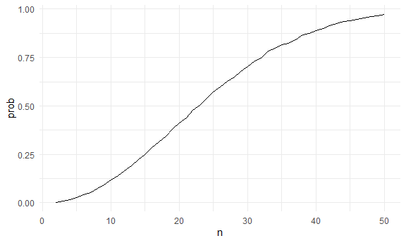
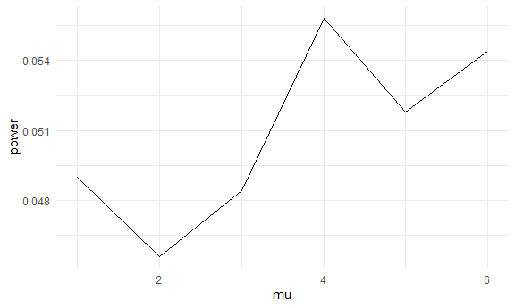
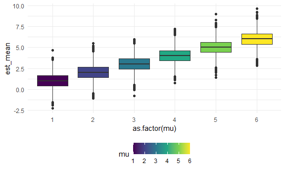
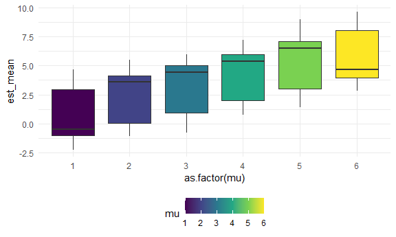
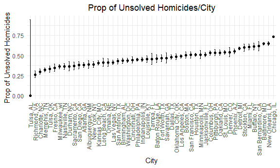

p8105_hw5_cm3341
================
Carolina Montes Garcia
2024-11-16

- [Problem 1](#problem-1)
- [Problem 2](#problem-2)
- [Problem 3](#problem-3)

## Problem 1

Probabily that two people in the same room share their birthday.

``` r
bday_sim = function(n) {

  bdays = sample(1:365, size = n, replace = TRUE)
  
  duplicate = length(unique(bdays)) < n

  return(duplicate)
  
}
```

Now I will run the simulation for sample sizes 2 and 50. I then run
these simulations 1000 times and plot the probability of 2 people having
the same birthday in the same room for each group size.

``` r
sim_res = 
  expand_grid(
    n = 2:50,
    iter = 1:10000
  ) |> 
  mutate(res = map_lgl(n, bday_sim)) |> 
  group_by(n) |> 
  summarize(prob = mean(res))

sim_res |> 
  ggplot(aes(x = n, y = prob )) + 
  geom_line()
```



## Problem 2

Create a function that generates values for a normal distribution and a
two sided t-test.

``` r
sim_mean_sd = function(n = 30, mu, sigma = 5) {
  
  sim_data = rnorm(n, mu, sigma)

  t_test = t.test(sim_data, y = NULL, mu = mu, alternative = "two.sided", conf.level = 0.95) %>% 
    broom::tidy() %>% 
    janitor::clean_names() %>% 
    select(p_value, estimate)

 out_df = 
   tibble(
    true_mean = mu,
    p_value = t_test$p_value,
    est_mean = t_test$estimate
    )

 return(out_df)
}
```

Now I simulate

``` r
output = vector("list", 5000)

for (i in 1:5000) {
  output[[i]] = sim_mean_sd(30, 0, 5)
}

sim_results = bind_rows(output)
```

Now I iterate the function for different mu values.

``` r
sim_res = 
  expand_grid(
    mu = c(1, 2, 3, 4, 5, 6),
    iter = 1:5000
  ) %>%  
  mutate(samp_res = map(mu, \(x) sim_mean_sd(n = 30, x, sigma = 5))   ) %>%  
  unnest(samp_res) %>% 
  select(mu, p_value, est_mean)
```

Plot 1

``` r
power_res =
  sim_res %>%
  group_by(mu) %>%
  summarize(
    power = mean(p_value < 0.05)
  )

power_res %>% 
  ggplot(aes(x = mu, y = power)) +
  geom_line()
```



Plot 2

``` r
sim_res %>% 
  group_by(mu) %>% 
  ggplot(aes(x = as.factor(mu), y = est_mean, fill= mu))+
  geom_boxplot()
```



Plot 3

``` r
sim_res %>% 
  group_by(mu) %>% 
  filter(p_value<0.05) %>% 
  ggplot(aes(x = as.factor(mu), y = est_mean, fill= mu))+
  geom_boxplot()
```


Is the sample average of mu hat across tests for which the null is
rejected approximately equal to the true value of mu? Why or why not?

Interpretation: The sample average of mu hat across test for which the
null is rejected is not approximately equal to the true value of mu
because in the cases of significance, mu hat would be found on the tail
ends of the normal distribution.

## Problem 3

Import data after downloading the csv file from github. Clean and tidy
data.

``` r
hom_data = 
  read_csv("data/homicide-data.csv")
```

    ## Rows: 52179 Columns: 12
    ## ── Column specification ────────────────────────────────────────────────────────
    ## Delimiter: ","
    ## chr (9): uid, victim_last, victim_first, victim_race, victim_age, victim_sex...
    ## dbl (3): reported_date, lat, lon
    ## 
    ## ℹ Use `spec()` to retrieve the full column specification for this data.
    ## ℹ Specify the column types or set `show_col_types = FALSE` to quiet this message.

This dataset contains observations for 52,000 homicides across 50 of the
US’s largest cities. Data is from the past decade. The dataset includes
demographic variables about victims (i.e., name, age, rage, sex), along
with date and location information for where the homicide took place,
and whether an arrest took place.

Create a city/state variable.

``` r
hom_data = 
  hom_data %>%
  mutate(city_state = paste(city, state, sep = ", "))
```

Summary table of homicides, including unresolved homicides, grouped by
city/state.

``` r
homs_by_city =
  hom_data %>%
  group_by(city_state) %>%
  summarize(
    homicides = n(),
    unsolved_homicides = sum(disposition %in% c("Closed without arrest", "Open/No arrest"))
  ) %>%
  arrange(desc(homicides))

knitr::kable(homs_by_city)
```

| city_state         | homicides | unsolved_homicides |
|:-------------------|----------:|-------------------:|
| Chicago, IL        |      5535 |               4073 |
| Philadelphia, PA   |      3037 |               1360 |
| Houston, TX        |      2942 |               1493 |
| Baltimore, MD      |      2827 |               1825 |
| Detroit, MI        |      2519 |               1482 |
| Los Angeles, CA    |      2257 |               1106 |
| St. Louis, MO      |      1677 |                905 |
| Dallas, TX         |      1567 |                754 |
| Memphis, TN        |      1514 |                483 |
| New Orleans, LA    |      1434 |                930 |
| Las Vegas, NV      |      1381 |                572 |
| Washington, DC     |      1345 |                589 |
| Indianapolis, IN   |      1322 |                594 |
| Kansas City, MO    |      1190 |                486 |
| Jacksonville, FL   |      1168 |                597 |
| Milwaukee, wI      |      1115 |                403 |
| Columbus, OH       |      1084 |                575 |
| Atlanta, GA        |       973 |                373 |
| Oakland, CA        |       947 |                508 |
| Phoenix, AZ        |       914 |                504 |
| San Antonio, TX    |       833 |                357 |
| Birmingham, AL     |       800 |                347 |
| Nashville, TN      |       767 |                278 |
| Miami, FL          |       744 |                450 |
| Cincinnati, OH     |       694 |                309 |
| Charlotte, NC      |       687 |                206 |
| Oklahoma City, OK  |       672 |                326 |
| San Francisco, CA  |       663 |                336 |
| Pittsburgh, PA     |       631 |                337 |
| New York, NY       |       627 |                243 |
| Boston, MA         |       614 |                310 |
| Tulsa, OK          |       583 |                193 |
| Louisville, KY     |       576 |                261 |
| Fort Worth, TX     |       549 |                255 |
| Buffalo, NY        |       521 |                319 |
| Fresno, CA         |       487 |                169 |
| San Diego, CA      |       461 |                175 |
| Stockton, CA       |       444 |                266 |
| Richmond, VA       |       429 |                113 |
| Baton Rouge, LA    |       424 |                196 |
| Omaha, NE          |       409 |                169 |
| Albuquerque, NM    |       378 |                146 |
| Long Beach, CA     |       378 |                156 |
| Sacramento, CA     |       376 |                139 |
| Minneapolis, MN    |       366 |                187 |
| Denver, CO         |       312 |                169 |
| Durham, NC         |       276 |                101 |
| San Bernardino, CA |       275 |                170 |
| Savannah, GA       |       246 |                115 |
| Tampa, FL          |       208 |                 95 |
| Tulsa, AL          |         1 |                  0 |

Filter for Baltimore, MD and count number of resolved vs. unresolved
homicides.

``` r
homs_baltimore = 
  hom_data %>% 
  filter(city_state == "Baltimore, MD") %>% 
  mutate(
    unsolved = as.numeric(disposition %in% c("Closed without arrest", "Open/No arrest")),
    resolved = as.numeric(disposition == "Closed by arrest")
  ) %>% 
  summarize(
    total_homicides = n(),
    unsolved_homicides = sum(unsolved)
  )
```

Prop.test for homicides in Baltimore, MD

``` r
prop_test_baltimore = 
  homs_baltimore %>%
  summarize(
    prop_test = list(
      prop.test(
        x = unsolved_homicides,
        n = total_homicides
      ) %>% broom::tidy()
    )
  ) %>%
  unnest(cols = c(prop_test)) %>%
  select(estimate, conf.low, conf.high) %>%
  rename(
    proportion_unsolved = estimate,
    lower_ci = conf.low,
    upper_ci = conf.high
  )

knitr::kable(prop_test_baltimore)
```

| proportion_unsolved |  lower_ci |  upper_ci |
|--------------------:|----------:|----------:|
|           0.6455607 | 0.6275625 | 0.6631599 |

Prop.test for all cities

``` r
prop_test_all_cities = 
  homs_by_city %>%
  mutate(
    prop_test = map2(
      unsolved_homicides, homicides, \(unsolved, total) {
        prop.test(x = unsolved, n = total) %>% broom::tidy()
      }
    )
  ) %>%
  unnest(cols = c(prop_test)) %>%
  select(city_state, estimate, conf.low, conf.high) %>%
  rename(
    proportion_unsolved = estimate,
    lower_ci = conf.low,
    upper_ci = conf.high
  )
```

    ## Warning: There was 1 warning in `mutate()`.
    ## ℹ In argument: `prop_test = map2(...)`.
    ## Caused by warning in `prop.test()`:
    ## ! Chi-squared approximation may be incorrect

``` r
knitr::kable(prop_test_all_cities)
```

| city_state         | proportion_unsolved |  lower_ci |  upper_ci |
|:-------------------|--------------------:|----------:|----------:|
| Chicago, IL        |           0.7358627 | 0.7239959 | 0.7473998 |
| Philadelphia, PA   |           0.4478103 | 0.4300380 | 0.4657157 |
| Houston, TX        |           0.5074779 | 0.4892447 | 0.5256914 |
| Baltimore, MD      |           0.6455607 | 0.6275625 | 0.6631599 |
| Detroit, MI        |           0.5883287 | 0.5687903 | 0.6075953 |
| Los Angeles, CA    |           0.4900310 | 0.4692208 | 0.5108754 |
| St. Louis, MO      |           0.5396541 | 0.5154369 | 0.5636879 |
| Dallas, TX         |           0.4811742 | 0.4561942 | 0.5062475 |
| Memphis, TN        |           0.3190225 | 0.2957047 | 0.3432691 |
| New Orleans, LA    |           0.6485356 | 0.6231048 | 0.6731615 |
| Las Vegas, NV      |           0.4141926 | 0.3881284 | 0.4407395 |
| Washington, DC     |           0.4379182 | 0.4112495 | 0.4649455 |
| Indianapolis, IN   |           0.4493192 | 0.4223156 | 0.4766207 |
| Kansas City, MO    |           0.4084034 | 0.3803996 | 0.4370054 |
| Jacksonville, FL   |           0.5111301 | 0.4820460 | 0.5401402 |
| Milwaukee, wI      |           0.3614350 | 0.3333172 | 0.3905194 |
| Columbus, OH       |           0.5304428 | 0.5002167 | 0.5604506 |
| Atlanta, GA        |           0.3833505 | 0.3528119 | 0.4148219 |
| Oakland, CA        |           0.5364308 | 0.5040588 | 0.5685037 |
| Phoenix, AZ        |           0.5514223 | 0.5184825 | 0.5839244 |
| San Antonio, TX    |           0.4285714 | 0.3947772 | 0.4630331 |
| Birmingham, AL     |           0.4337500 | 0.3991889 | 0.4689557 |
| Nashville, TN      |           0.3624511 | 0.3285592 | 0.3977401 |
| Miami, FL          |           0.6048387 | 0.5685783 | 0.6400015 |
| Cincinnati, OH     |           0.4452450 | 0.4079606 | 0.4831439 |
| Charlotte, NC      |           0.2998544 | 0.2660820 | 0.3358999 |
| Oklahoma City, OK  |           0.4851190 | 0.4467861 | 0.5236245 |
| San Francisco, CA  |           0.5067873 | 0.4680516 | 0.5454433 |
| Pittsburgh, PA     |           0.5340729 | 0.4942706 | 0.5734545 |
| New York, NY       |           0.3875598 | 0.3494421 | 0.4270755 |
| Boston, MA         |           0.5048860 | 0.4646219 | 0.5450881 |
| Tulsa, OK          |           0.3310463 | 0.2932349 | 0.3711192 |
| Louisville, KY     |           0.4531250 | 0.4120609 | 0.4948235 |
| Fort Worth, TX     |           0.4644809 | 0.4222542 | 0.5072119 |
| Buffalo, NY        |           0.6122841 | 0.5687990 | 0.6540879 |
| Fresno, CA         |           0.3470226 | 0.3051013 | 0.3913963 |
| San Diego, CA      |           0.3796095 | 0.3354259 | 0.4258315 |
| Stockton, CA       |           0.5990991 | 0.5517145 | 0.6447418 |
| Richmond, VA       |           0.2634033 | 0.2228571 | 0.3082658 |
| Baton Rouge, LA    |           0.4622642 | 0.4141987 | 0.5110240 |
| Omaha, NE          |           0.4132029 | 0.3653146 | 0.4627477 |
| Albuquerque, NM    |           0.3862434 | 0.3372604 | 0.4375766 |
| Long Beach, CA     |           0.4126984 | 0.3629026 | 0.4642973 |
| Sacramento, CA     |           0.3696809 | 0.3211559 | 0.4209131 |
| Minneapolis, MN    |           0.5109290 | 0.4585150 | 0.5631099 |
| Denver, CO         |           0.5416667 | 0.4846098 | 0.5976807 |
| Durham, NC         |           0.3659420 | 0.3095874 | 0.4260936 |
| San Bernardino, CA |           0.6181818 | 0.5576628 | 0.6753422 |
| Savannah, GA       |           0.4674797 | 0.4041252 | 0.5318665 |
| Tampa, FL          |           0.4567308 | 0.3881009 | 0.5269851 |
| Tulsa, AL          |           0.0000000 | 0.0000000 | 0.9453792 |

Plot that shows the estimates and CIs for each city

``` r
prop_test_all_cities %>%
  mutate(city_state = fct_reorder(city_state, proportion_unsolved)) %>%
  ggplot(aes(x = city_state, y = proportion_unsolved)) +
  geom_point() +
  geom_errorbar(aes(ymin = lower_ci, ymax = upper_ci), width = 0.2) +
  labs(
    title = "Prop of Unsolved Homicides/City",
    x = "City",
    y = "Prop of Unsolved Homicides") +
  theme(
    axis.text.x = element_text(angle = 90, vjust = 0.5, hjust = 1),
    plot.title = element_text(hjust = 0.5)
  )
```


